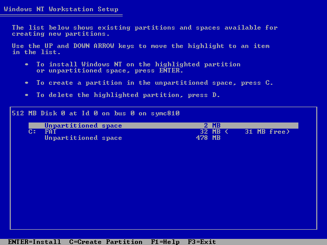

# powermac-nt-hal — a Windows NT 4.0 HAL for the Apple Network Server

[](https://github.com/pappadf/powermac-nt-hal/actions/workflows/build.yml)
[](LICENSE)

*This exists because of [`entii-for-workcubes`](https://github.com/Wack0/entii-for-workcubes) and
[`maciNTosh`](https://github.com/Wack0/maciNTosh) by **Wack0 (Rairii)**, and
[`maciNTosh-bandit`](https://github.com/MCJack123/maciNTosh-bandit) by **MCJack123**. Reading
their code is how this HAL knows what it knows. Thank you.*

A hardware abstraction layer (`HAL.DLL`) that lets **Windows NT 4.0 for PowerPC** run on the
**Apple Network Server 500/700** — a machine Apple never supported NT on, and which Microsoft's
PowerPC NT never shipped a HAL for. It is built from source with `clang` and `lld`, with no
Microsoft toolchain and no DDK.

The Network Server is a **TNT-class** machine — a Power Macintosh 9500 logic board with server
changes: Hammerhead, two Bandit PCI bridges, Grand Central, Cuda over a VIA. Most of this HAL is
therefore about the TNT family rather than about the ANS, and the machine-specific part is a
short, enumerated list: the external interrupt routing, the second Bandit, the two 53C825As, the
on-board Cirrus, and the timebase (all of `include/ans.h` plus `HalpPciInterruptLine`). Nothing
here has been tried on a desktop 7500/8500/9500 — and those machines have no ARC firmware of
their own, so booting NT on one needs
[`maciNTosh-bandit`](https://github.com/MCJack123/maciNTosh-bandit)'s loader as well as a HAL.
The door is deliberately left open; the claim is only about the ANS.

**Three names, and it is worth being precise.** The repository is `powermac-nt-hal`. The build
produces `build/hal.dll`, whose *internal* PE export name is `HAL.dll` — that one is not a
choice, because `NTKRNLMP.EXE` imports from the literal string `HAL.dll`. On the CD and on the
installed system it is **`HALSHINR.DLL`**, after Apple's codename for this logic board ("Shiner")
in the 8.3 form NT's loader expects, the same convention as Microsoft's own `HALEAGLE.DLL` and
maciNTosh's `halgoss.dll`; the HAL calls itself `halshinr` in its boot banner for that reason.
[`tools/mkoem.py`](tools/mkoem.py) is what puts that name on the CD, together with a computer
type of its own — Setup's hardware menu offers *"Apple Network Server 500/700"*, and installs
`HALSHINR.DLL` as the system's `hal.dll`. A sibling for desktop TNT machines would be a second
HAL built from the same sources.

Windows NT 4.0 Setup, running on an emulated Network Server 500, reading a partition table
through this HAL:



```
512 MB Disk 0 at Id 0 on bus 0 on symc810
      Unpartitioned space           2 MB
  C:  FAT                          32 MB (  31 MB free)
      Unpartitioned space         478 MB
```

## Where it stands

Setup gets through its hardware detection, licence agreement and partitioning, creates and
formats a partition, accepts an install directory, and begins writing to the disk. There has been
a next wall at every stage of this and there will be more; what follows is where it stands, not
where it stops:

| | |
|---|---|
| HAL loads, kernel starts | *Microsoft (R) Windows NT (TM) Version 4.0 (Build 1381)*, on ttya **and** on the machine's own Cirrus 54M30 monitor via a HAL framebuffer console |
| Storage | both Symbios 53C825A controllers found, the CD is the boot device, `disk.sys` and `fastfat` mount volumes |
| Keyboard | the ADB keyboard works — Cuda transport in the HAL, real keystrokes into Setup |
| Video | `cirrus.sys` initialises the 54M30 |
| Clock | the real time, read from Cuda, so installed files are dated correctly |
| Its own identity | Setup's hardware menu offers **"Apple Network Server 500/700"** and installs `HALSHINR.DLL` as the system's `hal.dll` — a `TXTSETUP.SIF` entry of our own, not another machine's HAL borrowed ([`tools/mkoem.py`](tools/mkoem.py)) |
| Setup | Welcome → mass storage → licence → hardware confirmation → partition list → format → `\WINNT` → copying → **"This portion of Setup has completed successfully"**, with no bugcheck in the run |
| The next wall | the restart. Setup wrote the installed system's boot configuration through `HalSetEnvironmentVariable`, but that store is in RAM — this machine has no ARC NVRAM — so a reboot loses the `OSLOADER` path the firmware would need |

Screenshots of every screen are in [`traces/`](traces/).

**Not yet:** a completed install; a keyboard driver of our own (see *Borrowed parts* below);
real hardware. The full list is in the charter, §9.

## What we were given

Two people had already done the hardest parts, and published them.

**[`entii-for-workcubes`](https://github.com/Wack0/entii-for-workcubes) — Wack0 (Rairii).** The
contract between the NT kernel and a PowerPC HAL is barely documented: the DDK gives you the
function names and almost nothing about the order, the ownership or the invariants. `halartx` is
a HAL that works, and reading it collapsed what would have been months of guessing — probably
several dead ends deep — into an afternoon. Who owns the IRQL and where it lives. Which
phase does what, and in which order. That the kernel's dispatch table is reached through the
PCR. Which routines you are allowed to leave as stubs, which is the difference between a HAL
that boots and a HAL that hangs with no clue why. Nine of the lines in our boot path are
recognisably the same as theirs because there is only one right way to write them.

**[`maciNTosh`](https://github.com/Wack0/maciNTosh) — Wack0 (Rairii) — and
[`maciNTosh-bandit`](https://github.com/MCJack123/maciNTosh-bandit) — MCJack123.** Cuda over
Grand Central's VIA, written down for *this* machine's silicon rather than something adjacent.
Because of it the Cuda handshake was never the unknown, and that matters more than it sounds:
getting a keyboard working still took five attempts, and **not one of them failed on the
protocol**. Every failure was a mistake of our own — interrupt ownership, calling a driver's
callback at IRQL 21, a `KDPC` that wanted 8-byte alignment, a checksum over a padded file, a
veneer poke lost in a rebuilt checkpoint.

Credit where it divides: **Wack0 wrote that code.** `inc/halpxi.h` — the three-function
HAL↔driver contract, and the only reason a keyboard driver could be talked to at all — is
byte-identical between the two projects, and 95% of the `pxi.c` we read (208 of 268 substantive
lines) is `maciNTosh`'s. **MCJack123 is the reason it reached us**: the Bandit port is what
moves Cuda to Grand Central `+0x16000`, this machine's address, and what showed that ADB source
for this chipset existed anywhere at all.

None of the three projects owes us anything, and this HAL would not exist without them. That is
a debt worth stating before anything else on this page; [`NOTICE`](NOTICE) records it file by
file.

## The story

The interesting document in this repository is **[`STORY.md`](STORY.md)** — every wall hit on
the way here, what each one turned out to be, and what it cost. Forty-four of them so far,
including a few that are worth reading whatever you work on:

- **The interrupt that never arrived** was not an interrupt problem: `HalAllocateAdapterChannel`
  was a stub, so every SCSI request failed before the miniport was ever asked to do anything.
- **An eight-byte return value** comes back through a hidden pointer in `r3` on this ABI, which
  quietly turned `KeQueryPerformanceCounter` into a function that returned the frequency.
- **"Setup could not load the keyboard layout file KBDUS.DLL"** was not about the file, the
  media, or the loader's search path. It was a rooted DOS path with no drive to root it
  against, because `IoAssignDriveLetters` was a stub and the machine had no drive letters at all.
- **The compiler put back the misaligned access twice** — folding four byte loads into one
  `lwz`, then merging byte stores into `stw` — each time turning careful code into an alignment
  exception on a little-endian 604.

## What is here

| | |
|---|---|
| [`src/`](src/), [`include/`](include/) | the HAL: ~2,800 lines of C and PowerPC assembly, 69 exports, 26 kernel imports |
| [`tools/`](tools/) | ELF→PE converter, import/export stub generator, ISO patcher, PowerPC disassembler, the test driver — 11 scripts, no external dependencies |
| [`docs/`](docs/) | the charter and the session write-ups ([index](docs/README.md)) |
| [`traces/`](traces/) | console output and screenshots backing every claim above |
| [`PROVENANCE.md`](PROVENANCE.md) | every borrowed line, its origin and its licence |

What the HAL does: `HalInitSystem` phases 0 and 1, the IRQL model and interrupt dispatch through
Grand Central, the decrementer clock and timebase, Bandit PCI configuration space for both
bridges with bus-address translation and `HalAssignSlotResources`, a machine-check handler that
survives stray PCI probes, DMA adapter objects, the MBR partition table over synchronous IRPs,
drive-letter assignment, an ARC firmware environment Setup can read and write, a Cuda/ADB
transport, and a text console on the Cirrus 54M30.

## Building

```bash
make          # -> build/hal.dll
```

Needs `clang-18`, `lld-18` and `python3`; any recent LLVM works. The build is reproducible —
two builds of the same tree are byte-identical (`SOURCE_DATE_EPOCH` overrides the PE timestamp
if you want a real one). There is no Microsoft tool, header or import library in the build;
[`tools/elf2pe.py`](tools/elf2pe.py) turns lld's ELF output into an NT PowerPC PE with function
descriptors, a pre-filled import table and base relocations, the way NT's boot loader needs it.

## Testing it

Development is against the [Granny Smith](https://github.com/pappadf/granny-smith) emulator,
which has the breakpoints, device logpoints and checkpoints that make this tractable.

> **The emulator support this needs is not in Granny Smith's mainline yet.** It is
> [PR #135](https://github.com/pappadf/granny-smith/pull/135), branch
> `ppc-le-mode-and-bandit-lane-reversal` — PowerPC little-endian mode, Bandit byte-lane
> reversal, and the Cirrus 54M30 identification registers. Build `main` and the firmware's
> little-endian reboot fails, long before anything mentions NT.
> **[`docs/EMULATOR.md`](docs/EMULATOR.md) is the step-by-step setup** — which branch, how to
> check you actually have it, how to build it, and what you must supply yourself (ROM, NT CD,
> disk images).

Once that is in place: build, write `hal.dll` over `HALEAGLE.DLL` on a *copy* of the CD, restore
a checkpoint at Setup's computer-type menu, and drive it:

```bash
python3 tools/run-hal.py --ckpt <menu.ckpt> --iso <copy-of-cd.iso> --out run.log \
        --delta-patch build/hal.dll --screenshot shot.png
```

[`docs/EMULATOR.md`](docs/EMULATOR.md) is the setup walkthrough,
[`tools/README.md`](tools/README.md) documents every option, and
[`docs/CHARTER.md`](docs/CHARTER.md) §3.1 has the firmware sequence and the gotchas.

## Borrowed parts, and one you should know about

**[`NOTICE`](NOTICE) is the attribution document** — which upstream taught which file, at which
commit, under which licence. [`PROVENANCE.md`](PROVENANCE.md) is the log behind it: one row per
borrowed thing, added at the moment it was borrowed, with its extent (verbatim / adapted /
rewritten from reading). Every source file repeats its own origin in its header. Nothing here
was copied from either upstream; both are recorded as *rewritten from reading*, and that is
still a derivation — which is where the licence comes from.

The keyboard currently works by loading **maciNTosh's `usbadb.sys`**, a binary this project may
**run locally but never redistribute** — it is GPL-2.0 with no published source, so GPL-2.0 §3
cannot be satisfied. Replacing it with a port driver of our own, written from
`entii-for-workcubes`' `fpsidrv` source, is the outstanding task; the HAL half of the interface
already exists here.

Nothing in this repository is derived from leaked Windows NT source. Everything came from the
DDK-documented `Hal*` contract, the shipped binaries' own COFF symbol tables, observed behaviour
under a debugger, and hardware documentation. See [`CONTRIBUTING.md`](CONTRIBUTING.md).

## A note on AI

This project allows the use of AI — not only for code generation or code review, but for
documentation as well. There is no commitment to track, at the file or commit level, which code
was written with AI assistance and which was not. I know that AI may be a red flag for some
people, and I fully respect that.

## Licence

**GPL-2.0-only** — see [`LICENSE`](LICENSE). This is not a preference; it follows from the
provenance log, because the HAL's structure was derived by reading GPL-2.0 sources. Every file
carries `SPDX-License-Identifier: GPL-2.0-only` and `Copyright (C) 2026 powermac-nt-hal contributors`;
[`AUTHORS`](AUTHORS) says who those are, [`NOTICE`](NOTICE) says whose work this builds on.

Windows NT, Microsoft, Apple, Power Macintosh, Symbios and Cirrus Logic are trademarks of their
respective owners, used here descriptively to say what this software is compatible with. This
project is not affiliated with, authorised by or endorsed by any of them.

## Credits

This project stands on other people's work:

- The **TinkerDifferent** thread [*"Apple Network Server: MacOS-based ROMs
  found"*](https://tinkerdifferent.com/threads/apple-network-server-macos-based-roms-found.4756/) —
  Mr. Macintosh, who got NT's Setup onto a real ANS 700 with a serial console and posted the
  transcript; ClassicHasClass, for the ROM dumps and the write-ups; joevt, for the ROM analysis
  and the detokenized firmware.
- **Wack0 / Rairii** — [`entii-for-workcubes`](https://github.com/Wack0/entii-for-workcubes),
  the NT 4.0 PowerPC HAL this one learned its shape from;
  [`maciNTosh`](https://github.com/Wack0/maciNTosh), NT for Power Macintosh, and the origin of
  both the Cuda code and the `HalPxi*` HAL↔driver contract this HAL implements; and `peppc`.
- **MCJack123** — [`maciNTosh-bandit`](https://github.com/MCJack123/maciNTosh-bandit), the port
  of that ARC firmware to Bandit-class Power Macs, which is what put the Cuda/ADB code on this
  machine's hardware.
