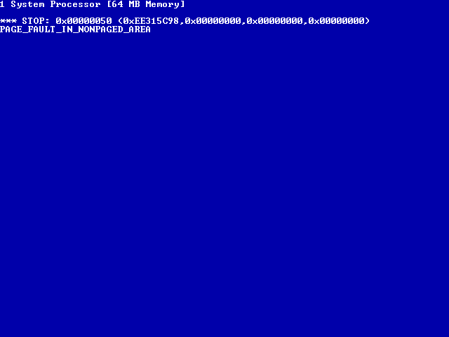

<!-- SPDX-License-Identifier: GPL-2.0-only -->
<!-- Copyright (C) 2026 powermac-nt-hal contributors -->

# Booting what Setup installed

*7 September 2026. Text-mode Setup finished the day before; this is the first attempt to start
the system it left on the disk. It reaches the kernel and bugchecks in a video driver, which is
much further than expected, and the five walls in between are all in the firmware and the loader
rather than in the HAL.*

## 1. What happens now

A cold boot of the installed disk, with the ARC environment injected into the veneer (§3):

```
Open Firmware -> VENEER.EXE -> \OS\WINNT40\OSLOADER.EXE -> NTOSKRNL.EXE + HAL.DLL
```

and on the machine's own monitor, through the HAL's Cirrus console:



Everything up to that bugcheck is new. In order, from the serial log:

```
HAL: halshinr 0.1 (HALSHINR-0.1-MARKER) for the Apple Network Server (phase 0)
HAL: boot device multi(0)scsi(1)disk(0)rdisk(0)partition(2)
HAL: hal path \os\winnt40\, options NODEBUG
HAL: nt boot path \WINNT\, setup block 00000000
HAL: 33 memory descriptors, 16384 pages; PCR irql 1, kseg0 top 80800000
HAL: phase 0 done
Microsoft (R) Windows NT (TM) Version 4.0 (Build 1381: Service Pack 1).
HAL: 54M30 console 640x480, font 8x12, 80x40 chars, fb 81000000
HAL: cuda clock e6c3acd4 -> 2026-9-6 23:50:44
HAL: module ntoskrnl.exe at 8064a000 size 00140000
HAL: module hal.dll     at 8078a000 size 0000e000
HAL: module symc810.sys / SCSIPORT.SYS / Disk.sys / CLASS2.SYS / Fastfat.sys
1 System Processor [64 MB Memory]
HAL: HalAssignSlotResources bus 0 dev 17 fn 0 -> 4 resources     <- the 53C825A
HAL: TranslateBusAddress type 5 bus 0 addr f3100000 space 0
HAL: GetAdapter type 5 bus 0 master 1 sg 1 maxlen 00ffffff
  ... ~60 x TranslateBusAddress space 1, ports 0x3b0-0x3df and 0x1ce/0x1cf ...
HAL: HalAssignSlotResources bus 0 dev 15 fn 0 -> 2 resources     <- the Cirrus 54M30

*** STOP: 0x00000050 (0xEE315C98,0x00000000,0x00000000,0x00000000)
PAGE_FAULT_IN_NONPAGED_AREA
```

`setup block 00000000` is the point: this is not Setup. `\WINNT` is being started as an
installed system, with the HAL that Setup copied — `tools/fatcat.py` confirms
`\OS\WINNT40\HAL.DLL` on the disk is byte-identical to `build/hal.dll`.

## 2. Two binaries that came with their symbol tables

Neither `VENEER.EXE` nor `OSLOADER.EXE` is a PE. Both are **raw COFF images** — no MZ stub, the
file starts at the COFF header — and both were shipped with `.symtab` intact: 1,512 symbols in
the veneer, 2,135 in OSLOADER, including every string constant's mangled `??_C@` symbol. That is
why this day's work is mostly reading rather than guessing. `tools/coffsyms.py` and
`tools/coffdis.py` are the two tools that made it readable; every claim below is from them.

`OSLOADER.EXE` also carries an `RT_MESSAGETABLE` resource with message ids 9000-10014, which
turns its error numbers into sentences. Worth knowing, because of the first wall.

## 3. Wall 45 — `BlInitResources` fails, so the errors arrive as hex

**Symptom.** After `OS Loader V4.00`, three bare eight-digit numbers and a stop:

```
0000232e
00002333
00002350
```

**What it was.** `%08lx\r\n` is the *only* format string of that shape in the image, and it sits
between the `BlFatalError` and `BlStartConfigPrompt` descriptors — it is `BlFatalError`'s
fallback when it cannot resolve a message id to text. It cannot, because the *first* thing that
failed was `BlInitResources`, which is what loads the message table: it opens OSLOADER's own
file to read its resource section, and that open failed.

Decoded against the message table, the numbers were:

| id | text |
|---|---|
| 9006 | Windows NT could not start because of a computer disk hardware configuration problem. |
| 9011 | Could not access disk partition tables |
| 9040 | Please check the Windows NT(TM) documentation about hardware disk configuration… |
| 9004 | Windows NT could not start because the following file is missing or corrupt: |
| 9017 | `<winnt root>\system32\ntoskrnl.exe` |
| 9038 | Please re-install a copy of the above file. |

Both failures were the same failure, and it is wall 46.

## 4. Wall 46 — a CD workaround applied to a disk

**Symptom.** `BlOpen` on `multi(0)scsi(1)disk(0)rdisk(0)partition(1)` recognises no filesystem.
`VrRead` tracing (`VrDebug` bit `0x1000`) shows all four recognisers run and all four reject:

| recogniser | reads |
|---|---|
| `IsFatFileStructure` | 62 bytes @ 0 — the BPB |
| `IsHpfsFileStructure` | 512 @ 0x2000, 512 @ 0x2200 — superblock and spareblock |
| `IsNtfsFileStructure` | 528 @ 0 |
| `IsCdfsFileStructure` | 2048 @ 0x8000 — the ISO Primary Volume Descriptor |

Every read *succeeded*. So the bytes at offset 0 were not a FAT BPB. `IsFatFileStructure`'s
first test is `buf[0] == 0xEB || 0xE9`; sector 0 of this disk is the MBR, whose boot code is
zeroed, and both partitions' real BPBs pass every one of the nine tests it applies.

**What it was.** The veneer had opened the **whole disk** instead of partition 1. Breaking just
before `OFOpen` and dumping the path it had assembled says so outright:

```
ihandle=0xff8d3200  /bandit@F2000000/53c825@12/sd@0,0@0,0:1,\os\winnt40\osloader.exe
ihandle=0xff8d2400  /bandit@F2000000/53c825@12/sd@0,0@0,0:0      <- partition(2), opened as ":0"
```

Open Firmware was not at fault. Driven by hand at its own `0 >` prompt, it is exact:

| path | first bytes of a 512-byte read |
|---|---|
| `sd@0,0:0` | `00 00 …` then the partition table at `0x1b8` — the MBR |
| `sd@0,0:1` | `EB 3C 90 "MSDOS5.0" … 02 01` — 512 B/sector, 1 sector/cluster |
| `sd@0,0:2` | `EB 3C 90 "MSDOS5.0" … 02 10` — 16 sectors/cluster |
| `sd@0,0@0,0:1` | identical to `:1` — the veneer's doubled unit address is harmless |

The cause was **our own patch**: the wall 22 workaround, a `nop` over the branch at veneer image
`0x54748`, which sends `partition(N)` *with no file path* down the whole-device route. That is
correct for the CD, where Apple's OF answers `:N` on an ISO with the root directory *as a file*.
It is exactly wrong for an MBR disk, where `:N` is the only thing that gives NT's loader
partition-relative sectors. Wall 22's workaround is CD-specific and had been inherited by a disk
boot unexamined.

**Fixed by** restoring `VrOpen`'s shipped bytes for `0x54744`-`0x5486b` before booting a disk.
Both fatal errors disappeared, and the message table loaded — which is to say wall 45 was never a
wall of its own.

**Note for anyone reproducing.** `machine.memory.poke.l A` writes the guest word at `A ^ 4`,
because in the 604's little-endian mode a word at `A` lives at physical `A ^ 4`. So the patch
that wall 22 describes at image `0x54748` is written `poke.l 0x5474c`. Both are correct; the
mismatch between them is a trap worth stating once.

## 5. Wall 47 — the loader's own path, written over the argv table

**Symptom.** `The 'osloader' parameter does not point to a valid file.`

**What it was.** `BlGetArgumentValue(argc, argv, "osloader")` scans argv backwards for a
case-insensitive `name=` prefix. The veneer's `create_argv` builds argv from a ten-entry table of
`{name, value, flags}`, and `add_argv` emits `name=value` — or just `value`, with no `=`, when
the name is an **empty string**. The trace showed exactly that:

```
Argv[0]: multi(0)scsi(1)disk(0)rdisk(0)partition(1)\os\winnt40\osloader.exe
Argv[1]: multi(0)scsi(1)disk(0)rdisk(0)partition(1)\os\winnt40\osloader.exe   <- no "OsLoader="
Argv[2]: SystemPartition=…
```

Slot 0's *name* string `'OsLoader'` lives at veneer image `0x5cd48`, immediately after the
boot-file path buffer at `0x5cd30`, which ships holding `\os\winnt\osloader.exe` — 22 characters.
Ours is `\OS\WINNT40\OSLOADER.EXE`, 24, and the patch that wrote it also NUL-padded eight bytes
past the end. It had erased the name.

**Fixed by** putting the path in `.text` tail padding (`0x5c388`, past the injected ARC
environment) and pointing the table's value field at it, leaving `0x5cd30`-`0x5cd4f` exactly as
shipped. `Argv[1]` became `OsLoader=multi(0)…\os\winnt40\osloader.exe`.

## 6. Wall 48 — the hive text-mode Setup left behind is only partly written

**Symptom.** `Windows NT could not start because the following file is missing or corrupt:
\WINNT\SYSTEM32\CONFIG\SYSTEM` — for a file that is present, 192,512 bytes, with a valid `regf`
header, matching sequence numbers and a correct header XOR checksum.

**What it was.** Instrumenting `BlLoadSystemHive` step by step showed every step succeed:

```
HIVEPATH \WINNT\system32\config\system
HIVEOPEN  status=0x0        BlOpen
HIVEINFO  status=0x0        BlGetFileInformation
HIVESIZE  0x2f000           the right size
HIVEALLOC status=0x0        BlAllocateAlignedDescriptor, LoaderRegistryData
HIVESEEK  status=0x0
HIVEREAD  status=0x0  buf=0x80798000  size=0x2f000
```

The file was read, in full, to the right place — so what rejected it is the step after,
`BlInitializeHive`, which is `HvInitializeHive` followed by `CmCheckRegistry`. (That call was
not instrumented on this run; with the repaired hive of the next paragraph it returns 1, and the
boot goes on to the kernel, which is the same conclusion from the other side.)

It is right to reject. Walking the hive's bins from the host finds **3 of the 46** the header's
length field accounts for. Everything from file offset
`0x4000` on is zeroes. `DEFAULT` is short by one bin the same way; `SYSTEM.SAV`, `SOFTWARE` and
`SOFTWARE.SAV` are complete.

That is the signature of a disk image captured before NT flushed its last writes — and `SYSTEM`
is the very last file text-mode Setup produces, copied from `SETUPREG.HIV` at the end of the run.

**Worked around, not fixed:** `tools/fatput.py` restores `SYSTEM` and `DEFAULT` from their own
`.SAV` copies, in place, which is what NT's own repair option does. The real fix is to capture
the disk image after Setup's restart prompt has actually flushed, and that is a test-rig change,
not a HAL one. Ledger row 15.

## 7. Wall 49 — where it stops *(open)*

`0x50 PAGE_FAULT_IN_NONPAGED_AREA`, referenced address `0xEE315C98`, immediately after

```
HAL: HalAssignSlotResources bus 0 dev 15 fn 0 -> 2 resources
```

Device 15 is the Cirrus 54M30. Its two resources are what its BARs say — memory
`0x81000000+0x1000000` and I/O `0x00010000` — and the ~60 `HalTranslateBusAddress` calls just
before it are a video driver walking the legacy VGA ports `0x3b0`-`0x3df` and the Cirrus
extension pair `0x1ce`/`0x1cf`, one address at a time.

What is *not* the cause, checked so far:

- The resource list's shape. `CM_PARTIAL_RESOURCE_DESCRIPTOR` is `pshpack4` in `include/nt.h`
  with a `_Static_assert` on its 16 bytes, so the kernel and the HAL agree on the layout; and
  the same code returned four resources for the 53C825A at device 17 without trouble.
- `0xEE315C98` is not any address the HAL handed back.

What it probably is, and the next measurement either way: this is the neighbourhood of
**ledger row 6**. During Setup, `VideoPortVerifyAccessRanges` rejected `cirrus.sys`'s claim on
the legacy `0xA0000` aperture — which is RAM on this machine — and every video result was
measured with that check bypassed by a diagnostic poke. A disk boot applies no such poke, so the
driver is meeting the conflict for the first time on its own. A clean failure would be
`ERROR_INVALID_PARAMETER`; a page fault is not that, so it may well be a second bug behind the
first.

**Next step**, concretely: break on `KeBugCheckEx`, read `SRR0`/`LR`, and name the module and
offset from the `HAL: module …` list. That says whether the faulting code is `videoprt.sys`,
`cirrus.sys` or the kernel, and it is one run.

## 8. What this leaves standing

- The boot chain works end to end, unattended, with no HAL change: firmware, veneer, OSLOADER,
  hive, boot drivers, kernel, HAL. Storage, the ARC tree, the framebuffer console, the Cuda clock
  and the memory descriptors are all exercised by a real system start rather than by Setup.
- Every wall on the way was in the firmware, the loader or the test rig. None was in the HAL.
- Two of them (46, 47) were **workarounds of ours misfiring**, which is the argument for the
  ledger in `STORY.md` existing at all: both were found by reading the ledger's own rows back.

## 9. Reproducing

The boot is driven by a Granny Smith script that loads a pre-`go` checkpoint, restores the
veneer bytes wall 46 and wall 47 describe, repoints `/chosen bootpath` at the 53C825A, and
injects a ten-variable ARC environment at OSLOADER's first `VrGetEnvironmentVariable`, because
this machine has no ARC NVRAM (ledger rows 11 and 12) and a reboot therefore starts with none.

That script is **not committed yet**: it carries the veneer's shipped instruction words inline,
and this project does not commit Microsoft code. Turning it into a generator that reads the
user's own `VENEER.EXE` — the pattern `tools/mkoem.py` already uses for a user's CD image — is
the first task on resuming, and then it belongs in `tools/`.

The ARC environment it injects, for the record:

| variable | value |
|---|---|
| `SYSTEMPARTITION` | `multi(0)scsi(1)disk(0)rdisk(0)partition(1)` |
| `OSLOADER` | `multi(0)scsi(1)disk(0)rdisk(0)partition(1)\os\winnt40\osloader.exe` |
| `OSLOADPARTITION` | `multi(0)scsi(1)disk(0)rdisk(0)partition(2)` |
| `OSLOADFILENAME` | `\WINNT` |
| `OSLOADOPTIONS` | `NODEBUG` |
| `LOADIDENTIFIER` | `Windows NT Workstation Version 4.00` |
| `AUTOLOAD` | `YES` |
| `COUNTDOWN` | `5` |
| `LASTKNOWNGOOD` | `FALSE` |
| `PROCESSORS` | `1` |

One detail costs an hour if you meet it cold: the veneer's `FindInLocalEnv` compares
`strlen(name) - 1` characters and `VrGetEnvironmentVariable` returns `entry + strlen(name)`, so
entries must be stored as `NAME` and value **concatenated with no `=` between them**. Store them
the obvious way and every value comes back with a leading `=`.

Also useful, and undocumented anywhere else we could find — the veneer's `VrDebug` bitmask
(poke a word at image `0x60C0C`):

| bit | traces |
|---|---|
| `0x0001` | `VrGetChild`, `VrGetPeer`, `VrGetParent`, `VrGetComponent`, `VrGetConfigurationData` |
| `0x0008` | the OBP → ARC device-tree conversion |
| `0x0010` | memory descriptors |
| `0x0020` | `main`, `parse_args`, `find_boot_dev`, the boot file and OsLoader paths |
| `0x0040` | the `Vr*Initialize` phases, `select_boot`, `choose_args` |
| `0x0100` | `ArcPathToNode`, `NodeToPath` |
| `0x0200` | `VrOpen`, `VrClose`, `VrMount`, `VrGetFileInformation`, `VrGetDirectoryEntry` |
| `0x0800` | `VrLoad` |
| `0x1000` | `VrRead`, `VrWrite`, `VrSeek`, `VrGetReadStatus` |
| `0x2000` | `Argv[n]` — the argv actually handed to the loader |
| `0x4000` | `VrGetEnvironmentVariable`, `VrSetEnvironmentVariable`, `GetEnvVar`, `FindInLocalEnv` |
