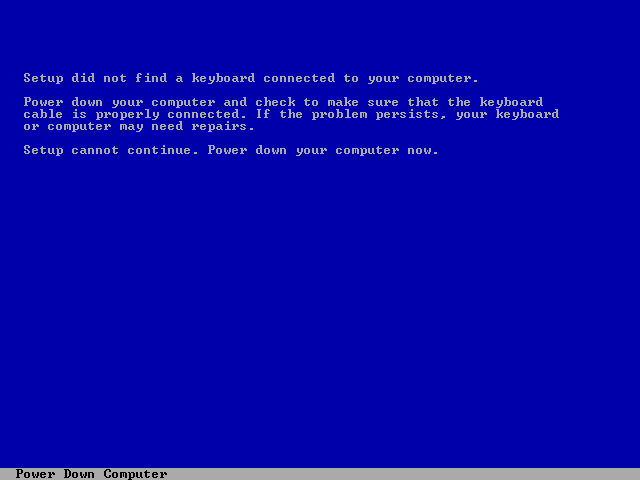
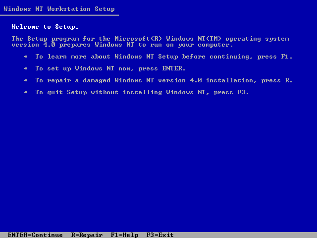
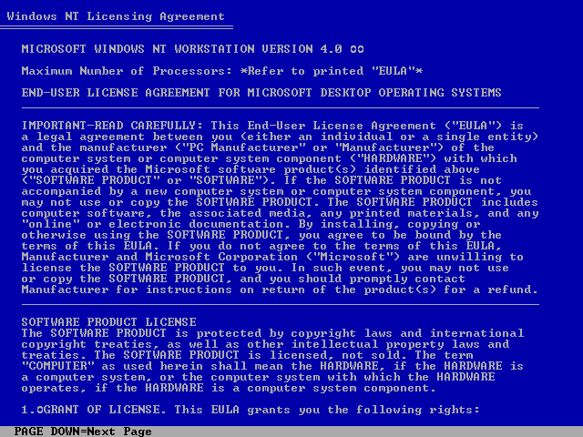
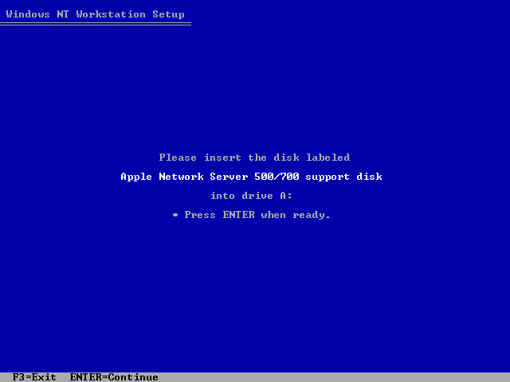

<!-- SPDX-License-Identifier: GPL-2.0-only -->
<!-- Copyright (C) 2026 powermac-nt-hal contributors -->

# The boot floppy

*15 September 2026. Stop patching the user's Windows NT CD. Everything this project adds — the
HAL, the veneer's patch sites, the ADB keyboard driver — moves onto a floppy, and the CD is used
unmodified, as pressed. Targeting the Apple Network Server first, but built so the same work
reaches a 7500/8500 later instead of being thrown away.*

> **Status: it works, and the shape is not the one this document first proposed.**
>
> A **stock, unmodified** NT 4.0 PowerPC CD — MD5 `ab37556d…`, not one byte written — now boots
> on the emulator to text-mode Setup, is offered *Apple Network Server 500/700* as a computer
> type, loads this project's HAL off the floppy, brings up the Cirrus through `cirrus.sys` and
> `videoprt`, takes an ADB keyboard driver off the same disk, and runs text-mode Setup on the ADB
> keyboard through the licence, the hardware list, the partition list and the install directory —
> **with no poke, breakpoint or patched CD anywhere in the run**, and with two typed lines per
> phase instead of twenty-eight (§4.5). It stops one step short of copying files (§4.6). Ledger row 8 is retired and wall 25, the oldest open item, is cleared (§4.3 says why
> it was never what the notes said it was), and wall 26 with it — the ADB keyboard driver arrives
> on the OEM disk under `[SCSI]`, which is how maciNTosh has always done it (§4.4). Ledger rows 8
> and 10 are both retired. Setup reaches its **Welcome screen**.
>
> The floppy is **not** the boot device. The firmware reads the veneer off it as raw blocks
> before anything is running, then boots the CD; Setup meets the floppy again later, as its
> ordinary *device support disk*. §2 is the sequence, §3 the evidence, §4 the two things that
> were in the way and how each was cleared. Booting *from* the floppy also now gets as far as
> Setup's own screens, and is kept in §2.2 because §7 may want it.

## 0. Before you start

This assumes nothing except a checkout. Read [`EMULATOR.md`](EMULATOR.md) first — it is the
step-by-step emulator setup — and [`CHARTER.md` §3.1](CHARTER.md#31-replicating-it) for what you
must supply yourself. In short:

| you need | notes |
|---|---|
| Granny Smith, branch `ppc-le-mode-and-bandit-lane-reversal` | **not `main`** — little-endian mode, Bandit lane reversal and the Cirrus id registers are unmerged. `make headless` |
| An ANS Open Firmware ROM | `ans-2.26NT`, MD5 `ad405e01c663340c479668c70f741f1b`. The **NT** ROM: §7 explains why that matters |
| An NT 4.0 Workstation PowerPC CD | OEM 000-48303, MD5 `ab37556d72818ed082c1d01c2d7f1898`. Work on a copy |
| This repo | `make` → `build/hal.dll` |

Neither the ROM nor the CD is in any repository, and neither may be redistributed.

### 0.1 Running an experiment

Everything below is a Granny Smith shell script (`.gs`) fed to the emulator. Two ways to run one:

```bash
# one-shot: builds a machine, runs the script, exits.  No daemon needed.
R=<path to the ANS ROM>
./build/headless/gs-headless --speed=turbo --no-prompt -q \
    rom=$R --var ROM=$R --checkpoint-dir=tmp/ckpt script=tmp/my.gs > tmp/my.log 2>&1

# against a long-lived daemon (needed by tools/run-boot.py, which splices a disk image)
./build/headless/gs-headless --daemon --port=6820 --speed=turbo --no-prompt -q \
    --checkpoint-dir=tmp/ckpt-daemon rom=$R --var ROM=$R &
python3 tools/gsh.py 'echo alive'
```

`--var ROM=` matters as well as `rom=`: the boot helper re-reads `$ROM` when it restarts the
machine to apply a console change.

### 0.2 Generating the scripts

```bash
# 1. the veneer, with the ledger's byte patches applied (rows 1-5 and 17)
python3 tools/mkveneer.py <PPC/VENEER.EXE> --out tmp/veneer-fd.exe --for cd

# 2. the floppy: that veneer, SETUPLDR, the HAL, the keyboard driver, a txtsetup.oem
python3 tools/mkbootfloppy.py --out tmp/boot-floppy.img \
        --veneer tmp/veneer-fd.exe --setupldr <PPC/SETUPLDR> \
        --hal build/hal.dll \
        --display-driver <cirrus.sys> --display-dll <cirrus.dll> \
        --vga-aperture 0x90000000
#   prints the veneer's start block and length -- pass them to step 3
#   build/adbport.sys goes on the disk by itself (--adb-driver PATH to substitute another), offered
#   under [SCSI]: at the mass-storage screen press S, then Other, then pick it.  That is the only
#   OEM class SETUPLDR loads arbitrary drivers for
#   the three display options are what clear wall 25 (4.3); without them Setup dies
#   initialising video.  cirrus.sys and cirrus.dll come off the user's own media

# 3. a cold boot of the *stock* CD, with the veneer read off the floppy
python3 tools/mkcoldboot.py --rom $R --cd <stock.iso> --staging <install-target.img> \
        --floppy tmp/boot-floppy.img \
        --veneer-dev /bandit/gc/swim3 --veneer-block 0x21 --veneer-blocks 0x13c \
        --cd-dev /bandit/53c825@11/sd@0,0 --out tmp/fd.gs --chunks 900
#   --console screen   type on the ADB keyboard instead of the serial port (see 9)
```

The install target is any disk with an ARC system partition —
`mkarcdisk.py --part 4096:65536 --part 69632:0`. Nothing is written to the CD at any point, and
`--cd` may be the user's own image opened read-only.

### 0.3 The artifacts these experiments used

None are in git; all are reproducible.

| artifact | what | how to make it |
|---|---|---|
| `tmp/boot-floppy.img` | **the floppy** | 0.2 step 2 |
| `tmp/veneer-fd.exe` | the patched veneer | 0.2 step 1 |
| the CD | **unmodified**, MD5 `ab37556d…` | — |
| `tmp/nt-onedisk.img` | 512 MB install target: ARC system partition at LBA 4096 | `mkarcdisk.py --part 4096:65536 --part 69632:0` |
| `tmp/nt-one.iso` | the *old* patched CD, only needed to reproduce the 4 experiments | `mkpatchediso.py` |
| `tmp/nt-pre-go-big2.ckpt` | pre-`go` checkpoint | expensive, and `mkcoldboot.py` makes it unnecessary. **Invalidated by any emulator rebuild** — `tools/restamp-ckpt.py <gs-headless> <ckpt>` fixes that when the rebuild changed no checkpointed structure |

### 0.4 The one command that reproduces the result

```bash
R=<ANS ROM>;  ISO=<stock NT CD>
python3 tools/mkveneer.py <PPC/VENEER.EXE> --out tmp/veneer-fd.exe --for cd
python3 tools/mkbootfloppy.py --out tmp/boot-floppy.img --veneer tmp/veneer-fd.exe \
        --setupldr <PPC/SETUPLDR> --hal build/hal.dll \
        --display-driver <cirrus.sys> --display-dll <cirrus.dll> --vga-aperture 0x90000000
python3 tools/mkcoldboot.py --rom $R --cd $ISO --staging tmp/nt-onedisk.img \
        --floppy tmp/boot-floppy.img --veneer-dev /bandit/gc/swim3 \
        --veneer-block 0x21 --veneer-blocks 0x13c \
        --cd-dev /bandit/53c825@11/sd@0,0 --out tmp/fd.gs --chunks 900
./build/headless/gs-headless --speed=turbo --no-prompt -q \
        rom=$R --var ROM=$R --checkpoint-dir=tmp/ckpt script=tmp/fd.gs > tmp/fd.log 2>&1
grep -c "Other" tmp/fd.log        # the computer-type menu, with a stock CD's ten entries + Other
```

Roughly twenty minutes on two cores, most of it the firmware typing at 6 M instructions per
character. Driving Setup past that menu means appending stages that send `\r` — the menu opens
on its **last** entry, which is `Other`; `tmp/fdD.gs` and `tmp/fdG.gs` in the write-up runs are
the pattern.

## 1. Why

The deliverable used to be a 578 MB ISO with 126 KB overwritten. It worked, it was verified, and
it could never be shared: it was Microsoft's disc with our bytes in it. Every recipient has to
bring their own CD anyway, so the only thing worth distributing is the 126 KB — plus whatever
replaces maciNTosh's `usbadb.sys`, which is not ours to redistribute either.

A floppy inverts that. The user keeps their CD untouched; we ship ~1.4 MB. It also makes the
browser-patcher idea trivial — no 578 MB upload, no in-place ISO surgery, just a download.

And it retires the two ledger rows that existed *because* we edited the disc:

| row | what | status |
|-----|------|--------|
| 7 | ~~HAL delivered by overwriting `HALEAGLE.DLL`~~ | retired earlier, by `mkoem.py` |
| 8 | ~~`TXTSETUP.SIF` and `\PPC` directory patches applied to a user's CD~~ | **retired here** — Setup takes the HAL from the OEM disk instead [E16][E17] |
| 10 | ~~the keyboard driver written over `\PPC\I8042PRT.SYS`~~ | **retired here** — it is a file on the OEM disk, offered under `[SCSI]` and picked with `S` at the mass-storage screen (§4.4) |

Rows 1–5 (the veneer patches) are *not* retired by a floppy, and this work added row 17 to them.
They are retired by §7.

One row is **not** retired and turns out to stand in the way: row 6, the
`VideoPortVerifyAccessRanges` bypass, still has no poke-free form, and §4.3 is where that now
bites.

## 2. How the boot works, step by step

Numbers in brackets are the evidence in §3.

**Once per machine, at the `0 >` prompt.** `little-endian?` is firmware NVRAM and `reset-all` is
what applies it; no medium can set it before the firmware has read the medium. This step cannot
be moved onto the floppy, and any claim of "insert and go" on a virgin machine is false.

```
setenv little-endian? true        \ present on plain ROMs too, not an NT extension  [E9]
setenv real-mode? false
setenv real-base 3F00000
setenv load-base 3E00000
reset-all
```

### 2.1 The arrangement that works: boot the CD, read the veneer off the floppy

The floppy is not the boot device. It is where the *firmware* gets the veneer, and later where
*Setup* gets its device support disk. The CD is never written to and never has to be.

```
dev /packages/pe-loader   3D00000 27800 map-space   dev /     \ map first, or DMA fails    [E2]
0 value diskih
" /bandit/gc/swim3" open-dev to diskih                        \ OF opens the drive         [E1]
3D00000 21 20 " read-blocks" diskih $call-method .            \ 0x13C blocks from 0x21,
                                                              \ 0x20 at a time             [E11]
diskih close-dev
dev /packages/pe-loader   3E00000 27800 map-space   dev /
3D00000 3E00000 27800 move   27800 to loadsize   init-program
" /bandit/53c825@11/sd@0,0" encode-string " bootpath" _chosen (property)   \ the CD
go
```

Block `0x21` and length `0x13C` are not magic: `mkbootfloppy.py` allocates the veneer first, so
it starts at cluster 2, and prints both numbers. Nothing here parses a filesystem — the firmware
reads sectors, which is why the veneer can be a file *and* be loadable before anything exists to
read files with.

**What happens after `go`:**

1. The veneer starts at `0x50000`, already carrying ledger rows 1–5 and 17 as bytes.
2. It reads `/chosen bootpath` — the CD — and builds its ARC device tree. The drive is in that
   tree as `multi(0)disk(0)fdisk(0)`, which is what row 17 buys [E13].
3. It loads `\PPC\SETUPLDR` from the CD and starts it. **The CD is the one that was pressed**
   [E15].
4. Setup reaches the computer-type menu, whose last entry is `Other`.
5. `Other` makes SETUPLDR ask for the manufacturer's disk and read `\TXTSETUP.OEM` off
   `multi(0)disk(0)fdisk(0)` — the floppy. It offers *Apple Network Server 500/700* [E16].
6. Choosing it loads `\HALSHINR.DLL` from the floppy, and Setup goes on to its own drivers:
   configuration data, fonts, locale, PCMCIA, `SCSIPORT`, `symc810`, `atdisk`, `ntfs`, `cirrus`,
   `videoprt`, `floppy`, `cdrom`, `disk`, `sfloppy`, `i8042prt`, `kbdclass`, `fastfat`, `cdfs`
   [E17].
7. At the mass-storage screen, `S` / `Other` offers the ADB keyboard driver off the same disk,
   and at the video screen `Other` offers the Cirrus entry that carries ledger row 6 (§4.3).
8. NTOSKRNL starts on this HAL, reads the partition table, assigns drive letters, resolves its
   install source to `E:\PPC` — the CD — brings up the Cirrus, finds the keyboard, and reaches
   Setup's Welcome screen.

### 2.2 The other arrangement: boot *from* the floppy

Point `bootpath` at the drive instead and the veneer loads `\PPC\SETUPLDR` off the floppy — the
shape this document originally proposed. It now goes further than §4.3's run, and far enough to
settle what it is worth:

* With `\PPC\TXTSETUP.SIF` on the floppy, SETUPLDR reads its INF from the floppy and gets past
  `INF file txtsetup.sif is corrupt or missing`.
* It then asks for **the disk labeled `Windows NT Workstation CD-ROM`**, which it identifies by
  the tag file `\CDROM_W.40` that `[SourceDisksNames]` names — and it looks for it **on the
  device it booted from**, not on the CD sitting in the SCSI drive. Pressing Enter re-prompts
  for ever.
* Put a copy of that tag file in the floppy's root and Setup accepts the floppy *as the
  distribution* — and dies immediately, `DEFAULT CATCH!, code=FFF00700 at %SRR0: 00000000`,
  because the files it then wants are not there.

**So the boot medium is the source medium** [E18]. That is the fact that decides this
arrangement: a 1.44 MB floppy cannot be NT's text-mode source. `setupdd.sys` alone is 299 KB,
`ntfs.sys` 594 KB and the kernel 1.3 MB.

It is kept because §7 may want it, and because the next medium up — a small FAT partition on the
disk the user is installing to, built from their own CD, with the CD still never written — would
have the same shape and none of the size problem. That is what §4.4 leaves for whoever is next.

## 3. What we have actually verified

Every row was measured on the emulator, not inferred.

| id | claim | evidence |
|----|-------|----------|
| E1 | Open Firmware sees and opens the floppy | `/bandit/gc/swim3@15000` in `dev /bandit/gc ls`; `open-dev` → `4D6040`. `/swim3/disk` → `0`, so there is no child node |
| E2 | Open Firmware can **read blocks** off it | `3C00000 0 8 " read-blocks" fdih $call-method` then host peek → `EB 3C 90 'M'`, `'SDOS'` — the FAT12 boot sector we wrote. **Only works when `map-space` is issued inside `dev /packages/pe-loader`**; outside it, `map-space` is an unknown word and the read fails `bad address to DMA-MAP-IN` |
| E3 | SETUPLDR resolves files against its **boot device**, and parses the filesystem itself | With `VrDebug 0x1200` over a whole Setup run: 4 × `VrOpen multi(0)scsi(0)cdrom(0)fdisk(0)` (the raw device), 1 × `…\PPC\SETUPLDR`, and **zero** by-name `.SYS` opens. The device is character-for-character the path it booted from |
| E4 | OEM-disk support is compiled into **SETUPLDR** | `D:\nt\private\ntos\boot\setup\oemdisk.c` at two offsets, beside `setup.c` and `arcdtect.c`; strings `ForceOemHal`, `Hal.Load`, `Computer`, `Map.Computer`, `Disks`, `Files.`, `Config.`, `Defaults`, `Strings`, `txtsetup.oem` |
| E5 | SETUPLDR's I/O is firmware I/O | `VrOpen: Exit - FileId: 2 IHandle: ff8d3200` — an Open Firmware instance handle. ARC → veneer → OF, no NT driver |
| E6 | `setupdd.sys` has an **NT-side** OEM path | wide strings `\device\floppy0\txtsetup.oem`, `\device\floppy%u`, sections `Disks Defaults Computer Display Keyboard Mouse SCSI` |
| E7a | The veneer does not enumerate the floppy **when the boot path does not name it** | Full ARC dump (31 `dump_node` entries) with a floppy inserted and `bootpath` on the hard disk: exactly **one** `FloppyDiskPeripheral`, `Parent → CdromController` — the `fdisk(0)` tail of the CD path. Identical with and without a disk in the drive |
| E7b | It **does** enumerate it when `bootpath` names it — but typed it `other`, and `VrOpen` then failed | `find_boot_dev: bootpath (len 16) '/bandit/gc/swim3'` → `find_boot_dev: bootpath 'multi(0)other(0)other(0)'` → `VrOpen returned 8` = `EIO`. Superseded by E13 |
| E8 | The emulator models the hardware already | `ans500.c` declares `.floppy_slots = tnt_floppy_slots` ("Internal FD0", `FLOPPY_HD`); `tnt.c` binds SWIM3 to Grand Central and DBDMA. Insert works and survives `reset-all` |
| E9 | `pe-loader` is the **only** NT-ROM-specific package | `ans-2.26NT` packages: deblocker, disk-label, obp-tftp, mac-files, mac-parts, aix-boot, fat-files, iso-9660-files, xcoff-loader, **pe-loader**, terminal-emulator. Plain `ans-1.1.22`: the same list **minus `pe-loader`**. `little-endian?` exists in both |
| E10 | `nvramrc` exists on this firmware | `printenv` shows `use-nvramrc? false`, `auto-boot? true`, `boot-command boot`, and `nvramrc` |
| **E11** | **The firmware loads the veneer off the floppy** | `mkcoldboot.py --veneer-dev /bandit/gc/swim3 --veneer-block 0x21`: sixteen `read-blocks` calls, then `init-program` → `Loading PE/COFF image_base 50000`, and the generated patch-site read-back finds all six ledger sites correct in guest memory. The floppy is a normal FAT12 disk at the same time — the veneer is `\PPC\VENEER.EXE`, contiguous from cluster 2 |
| **E12** | **The veneer's own open of the drive needs the drive to have been opened once from the `0 >` prompt** | Same script, one line different. Without it: `NodeToPath returning '/bandit@F2000000/gc@10/swim3@15000'`, `OFOpen: IHandle: 0`, `VrOpen returned 8`. With `" /bandit/gc/swim3" open-dev` before `go`: `OFOpen: IHandle: ff8d3100`, `VrOpen: Exit`. It is **not** the path — typed at the prompt, `open-dev` answers that exact fully-qualified string with a valid ihandle (`-72C6C0`). The mechanism is not established; the correlation is. §2.1 never has to care, because reading the veneer off the drive opens it |
| **E13** | **Ledger row 17 gives the drive the ARC name SETUPLDR uses** | `convert_name: node swim3 (780c) type 'block' is Class ControllerClass Type DiskController`, `add_new_child: parent swim3(0x780c) will get child fdisk Type FloppyDiskPeripheral`, `find_boot_dev: bootpath 'multi(0)disk(0)fdisk(0)'`. Before: `OtherController`, `OtherPeripheral`, `multi(0)other(0)other(0)` |
| **E14** | **SETUPLDR contains a complete FAT reader** — R2 answered | 24 `Fat*` symbols in its table, from `IsFatFileStructure` and `FatOpen` to `FatLookupFatEntry` and `FatVboToLbo`. `IsFatFileStructure` reads 0x3E bytes at offset 0 and checks the jump byte (`EB`/`E9`), bytes-per-sector ∈ {0x80,0x100,0x200,0x400}, and a power-of-two cluster size — all of which `mkbootfloppy.py` writes |
| **E15** | **A stock CD boots** | The user's own image, MD5 `ab37556d…`, attached and not written: `Booting from 'multi(0)scsi(0)cdrom(0)fdisk(0)\PPC\SETUPLDR'` → Setup's computer-type menu, the stock ten entries and `Other` |
| **E16** | **Setup reads `txtsetup.oem` off the floppy and offers our computer type** | `Other` → *"Please insert the disk labeled Manufacturer-supplied hardware support disk into Drive A:"* → Enter → *"using a device support disk provided by the computer's manufacturer"* and a one-entry list: **Apple Network Server 500/700**. R4 answered |
| **E20** | **The floppy boots itself in two typed lines** | `load fd:,\setup.of` + `load-base loadsize eval` resets the machine into little-endian mode; `load fd:,\boot.of` + the same eval lays out the veneer and reaches Setup's computer-type menu. Both scripts are generated by `mkbootfloppy.py` and live on the disk |
| **E19** | **An OEM `[SCSI]` entry delivers the ADB keyboard driver** | `S` at the mass-storage screen, `Other`, our disk, and *"Apple Desktop Bus keyboard and mouse (via Cuda)"* is offered, chosen and loaded — `HAL: module usbadb.sys at 806e7000`. `i8042prt.sys` and `kbdclass.sys` still load from the CD alongside it; `Setup did not find a keyboard` never appears, Setup reaches its Welcome screen, and two Enter presses **on the ADB keyboard** carry it to the licence agreement. The SCSI class is the one SETUPLDR loads any number of drivers for, in a loop, without checking what they are |
| **E18** | **The boot medium is the source medium** | Booted from the floppy with its own `TXTSETUP.SIF`, SETUPLDR asks for the tag file `\CDROM_W.40` *in the drive it booted from*, and never looks at the CD — it re-prompts for ever. Give the floppy that tag and it accepts the floppy as the distribution and dies at `%SRR0: 00000000` when the files are not there |
| **E17** | **Our HAL is loaded from the floppy, and Setup carries on** | `Setup is loading files (Apple Network Server 500/700)...` then Configuration Data, Setup Font, Locale, Windows NT Setup, PCMCIA, SCSI Port Driver, `Symbios Logic C810 PCI SCSI Host Adapter`, ESDI/IDE, NTFS, the Cirrus display, floppy, CD-ROM, SCSI disk, keyboard, FAT and CDFS — then `HAL: halshinr 0.1 … (phase 0)`, 54 memory descriptors, both 53C825As, `IoReadPartitionTable`, `C:`/`D:`/`E:`, and `system path -> 'E:\PPC'` |

The **`\HALSHINR.DLL` at the root** detail is E17's other half: with the `[Disks]` directory
field set to `\`, Setup asks for `\halshinr.dll`, so the OEM files live in the floppy's root and
only `\PPC` mirrors the CD.

## 4. What was in the way

Two things, not one, and neither was what §4 first said.

### 4.1 The open — solved, and not by a patch

E7b read as "`VrOpen` returns `EIO` on the drive", and the natural reading was that the veneer
cannot do floppy I/O. It can. `VrOpen` has exactly one site that returns 8 (veneer `0x548C0`,
`li r3,0x8`), reached only when `OFOpen` handed back a null ihandle — so the veneer gets all the
way to an Open Firmware `open` on a correctly built path and *Open Firmware* declines. Open the
drive once at the `0 >` prompt first and the same call succeeds (E12).

That is a fix in **our** boot script, not in Microsoft's binary — which is what §7's design rules
ask for. §2.1 gets it for nothing, because the veneer is read off that drive.

### 4.2 The ARC name — ledger row 17, six bytes

`VrDebug` bit `0x0008` traces the OBP → ARC conversion, and it says exactly what happens:

```
convert_name: node swim3 (780c) type 'block' is Class ControllerClass Type OtherController
```

`convert_name` classifies by Open Firmware `device_type` and `name`. `device_type` `block` gives
`ControllerClass`; then the *name* decides — `disk` and `floppy` both give `DiskController`,
`cdrom` gives `CdromController`, anything else falls through to `OtherController`. Apple's node
is `device_type block`, `name swim3`, so it falls through, `convert_controller` hangs an
`OtherPeripheral` off it, and the path is `multi(0)other(0)other(0)`.

The same string is read at all three places that matter: the classification, the `fdisk` child
`convert_controller` adds to a `DiskController`, and the `convert_config` special case that calls
`convert_config_floppy`. So renaming `floppy` → `swim3` in the image turns all three on at once
and produces `multi(0)disk(0)fdisk(0)` — character for character the `multi(0)disk(0)fdisk(%d)`
in SETUPLDR's own string table. Six bytes, `tools/mkveneer.py`, ledger row 17, ANS-only like
every veneer patch.

An attempt to do this *without* patching the veneer — rewriting the node's `name` property from
the firmware prompt — was tried first and does not work: `" floppy" encode-string " name"
property` reports `ok`, and `dev /bandit/gc/floppy` then says `can't find device`. Open
Firmware's path lookup does not follow a replaced `name`.

### 4.3 Wall 25 — cleared, and it was ours

With both cleared, a stock CD gets all the way through NTOSKRNL's device initialisation —
`SCSIPORT`, `symc810`, `atdisk`, `ntfs`, `cirrus`, `videoprt`, `floppy`, `cdrom`, `disk`,
`sfloppy`, `i8042prt`, `kbdclass`, `fastfat`, `cdfs`, both 53C825As, the partition table, drive
letters, and `system path -> 'E:\PPC'` — and then stopped at

```
Setup has encountered a fatal error while initializing your computer's video.  (0, 0xc0000034)
```

**wall 25**, `STORY.md`'s oldest open item, whose recorded diagnosis was *a resource conflict
with the machine's physical memory*. It is not, and it has not been since we fixed something
else. The full re-measurement is in `STORY.md` under wall 25; the short version:

* `VideoPortVerifyAccessRanges` is a wrapper. The work is at videoprt `0x12efc`, which turns the
  miniport's `VIDEO_ACCESS_RANGE` array into a `CM_RESOURCE_LIST` and calls
  `IoReportResourceUsage`. It adds **no memory ranges of its own**.
* That array is `cirrus.sys`'s own static table at image VA `0x1B480` — confirmed live at
  `r5 = 0x80704480`, exactly where that table lands.
* The call returns **`0xC000000D`, `STATUS_INVALID_PARAMETER`** — not `0xC0000018`,
  `STATUS_CONFLICTING_ADDRESSES`, which the same code has a separate path for. It still returns
  it with all four ranges moved somewhere nothing can claim.
* `IoReportResourceUsage` translates every reported range through the HAL, and our own trace had
  been printing the answer for months: `0x3b0`, `0x3bb`, `0x3c0`, `0x3df`, `0xa0000`, `0xbffff`
  — and then it stops, never reaching the framebuffer. **We refuse `0xA0000`**, deliberately,
  because on this board it is ordinary RAM. The kernel turns that refusal into
  `STATUS_INVALID_PARAMETER`.

So the aperture claim has to name an address the machine can actually translate.
`mkbootfloppy.py --vga-aperture 0x90000000` rewrites that one entry in the miniport's table and
recomputes the PE checksum — and the miniport is a file `txtsetup.oem` **can** carry, which
`VIDEOPRT.SYS` is not (one image per OEM class, imports resolved from the CD: measured).

**The result, with no poke anywhere:** Setup initialises video, switches its UI off the HAL's
two-colour console onto the Cirrus, and asks the next question.



That grey status bar with black text is Setup drawing through `cirrus.sys`, which is how wall 24
recorded the difference. The message on it is **wall 26**, the keyboard — the wall this project
has already solved, but by writing a driver over the CD's `\PPC\I8042PRT.SYS`, which is
precisely what this plan retired. Our floppy carries that driver and a `[Keyboard]` class for it;
Setup has not yet been made to ask for it. That is the next step (§6).

Three things this cost that are worth stating once:

1. **`0x70000000` looked like a dead end and was the same bug.** The September note records that
   address as making the check pass, so an early attempt here used it — and it is *also* below
   `0x80000000`, so our HAL refused it exactly as it refuses `0xA0000`. Both measurements were
   right on the day they were taken; the HAL rule between them is what changed.
2. **An OEM `[Display]` class cannot carry a patched `VIDEOPRT.SYS`.** `SlInit` calls
   `SlLoadOemDriver` once after `SlPromptOemVideo`, and it loads the *first* file key in the
   section. With `port` first, `videoprt.sys` came off the floppy and no miniport loaded at all;
   with `driver` first, `cirrus.sys` came off the floppy and its import of `VIDEOPRT.SYS` was
   resolved from the CD. That is why the fix had to be in the miniport.
3. **A status code is not a diagnosis.** `ERROR_INVALID_PARAMETER` was in the notes from the
   start; nine months of work read it as "the conflict check failed" because that is what the
   first investigation concluded. The code that produces it says otherwise in about forty
   instructions.

### 4.4 Wall 26 — the keyboard, through the class nobody would guess

Past video, Setup asks the next question and it is **wall 26**: *"Setup did not find a keyboard
connected to your computer."* It is right — the keyboard is ADB behind Cuda, and the CD's
`i8042prt.sys` probes a port `0x60` this machine does not have. This project solved it months ago
by writing a replacement over the CD's `\PPC\I8042PRT.SYS` (ledger row 10) — exactly what this
plan set out to stop doing.

**It is delivered through the `[SCSI]` class.** Not `[Keyboard]`.

The reasoning that says otherwise is seductive and wrong, and this document contained it for a
few hours. It goes: SETUPLDR has OEM prompts for SCSI, Computer and Display and none for the
keyboard (true — there are exactly two `SlLoadOemDriver` call sites, one for SCSI in a loop over
a list, one for video, and `SlPromptOemHal` has none at all); `txtsetup.oem`'s `[Keyboard]`
section belongs to `setupdd.sys`, which runs under NT behind a floppy driver that does not exist
(also true); therefore an OEM disk cannot deliver a keyboard driver (**false**).

What that misses is that the SCSI class does not check what it is loading. It is the one class
SETUPLDR loads *any number* of drivers for, in a loop, and it will load any NT driver you name.
A driver that creates `\Device\KeyboardPort` and `\Device\PointerPort` — which is what
`kbdclass` and `mouclass` open — works perfectly well when Setup thinks it is a SCSI miniport.

maciNTosh has shipped it this way all along, and its README says so in plain sight: at the
mass-storage screen, *press `S` to pick a driver, choose `Other`*, and the entry is
**"PowerMac General HID & Storage"** — a driver whose own description is *"currently only
implements ADB keyboard/mouse and ramdisk as floppy drive for installing drivers at text setup
time"*. Same chipset family, same problem, same solution. The lesson is the cheap one: when a
neighbouring project has solved the thing you have just proved impossible, read how before
publishing the proof.

So `mkbootfloppy.py --adb-driver` puts the driver on the disk as `USBADB.SYS` and offers it as:

```
[SCSI]
usbadb = "Apple Desktop Bus keyboard and mouse (via Cuda)"

[Files.SCSI.usbadb]
driver = d1, usbadb.sys, usbadb
```

The key is `usbadb`, not `i8042prt`, because the CD's real `i8042prt.sys` still loads by name
from `TXTSETUP.SIF` and two services cannot share one name. Both end up in the module list; only
ours finds a keyboard.

**The result, on a stock CD with no poke anywhere** [E19]: `S`, `Other`, Enter, and Setup reports

```
Setup will load support for the following mass storage device(s):
    Symbios Logic C810 PCI SCSI Host Adapter
    Apple Desktop Bus keyboard and mouse (via Cuda)
```

then loads it (`HAL: module usbadb.sys`), and the keyboard message never appears:



And it is a working keyboard, not just a detected one: two Enter presses typed on the **ADB
keyboard** — `keyboard.down` / `keyboard.up` with guest time between them, the wall-57 rule — take
Setup from Welcome through the hardware list to the licence agreement.



**Ledger row 10 is retired** — for real this time. Row 9 is not: the driver is still maciNTosh's
`usbadb.sys`, which we may run and may not redistribute, and C5 is still what fixes that.

### 4.5 The typing: twenty-eight lines down to two

C6 was written as "put the §2.1 block in `nvramrc`". There is a better answer, and the floppy
carries it. **Open Firmware reads and runs a Forth script off the disk itself**, so the user types
two lines, twice:

```
0 >  load fd:,\setup.of          \ once per machine: little-endian mode, then reset
0 >  load-base loadsize eval

0 >  load fd:,\boot.of           \ every boot: lay out the veneer and start Setup
0 >  load-base loadsize eval
```

`mkbootfloppy.py` generates both and puts them on the disk. Verified end to end: `setup.of` resets
the machine, and `boot.of` prints `Loading PE/COFF image_base 50000`, then
`Booting from 'multi(0)scsi(0)cdrom(0)fdisk(0)\PPC\SETUPLDR'`, then Setup's computer-type menu
[E20].

What each of those lines depends on, all measured at the `0 >` prompt:

* **`fd` is already a devalias** for `/bandit/gc/swim3`. The ROM ships it.
* **The comma is required.** `load fd:\boot.of` fails `PARTITION is not a number`, because Open
  Firmware parses what follows `:` as a partition number: the syntax is `device:partition,path`.
* **`dir fd:,\` lists the disk**, so the ROM's `fat-files` reads our FAT12 image directly — no
  filesystem work of our own.
* **CRLF line endings, or nothing happens.** A `\` comment runs to end of *line*; with LF only,
  Open Firmware never sees a line end, swallows the whole file as one comment, evaluates in
  silence and does nothing. It looks exactly like `eval` being broken.
* **Everything in one colon definition.** `load` puts the text at `load-base`, which §2.1 sets to
  `3E00000` — the very address the veneer is moved to. Compiling first means the text is consumed
  before the move destroys it, and `go` never returns to read more. Relocating the text is not an
  option: `3E00000 to load-base` answers **`invalid use of TO`**.
* **`map-space` as a method, not through `dev`.** `dev` is interpret-only; `map-space` exists only
  inside `/packages/pe-loader`. `" map-space" nt-pe $call-method` reaches it from inside a
  definition — the same shape the block read already uses.
* **`4000 1000 map-space` after `init-program` is not a diagnostic.** `mkcoldboot.py` does it and
  the boot works; leave it out and the veneer dies at its own `0x52FC8` with
  `DEFAULT CATCH!, code=FFF00300`, a DSI. Ledger row 1 nops the veneer's `claim` of the SYSTEM
  PARAMETER BLOCK and RESTART BLOCK, which live in that page — with the claim skipped, somebody
  still has to map it, and this is who. That cost a run, and it was a line I had dismissed as
  instrumentation.

`setup.of` cannot be folded into `boot.of`: `little-endian?` is firmware NVRAM and `reset-all` is
what applies it, so no medium can set it before the firmware has read the medium. Any claim of
"insert and go" on a virgin machine is still false. `nvramrc` on top of this would take the
per-boot case to zero lines, and is now a two-line thing to store rather than twenty-eight.

### 4.6 The install: everything except the last copy

With the two-line boot, a stock CD and the floppy, text-mode Setup now runs the whole way
through on its own hardware:

| | |
|---|---|
| Computer type | *Apple Network Server 500/700*, our HAL, off the floppy |
| Mass storage | *Symbios Logic C810* **and** *Apple Desktop Bus keyboard and mouse (via Cuda)* — NT lists our ADB driver as a recognised device |
| Video | *Cirrus Logic 54M30 (Apple Network Server 500/700)*, off the floppy, wall 25 cleared |
| Licence, hardware list | driven entirely on the **ADB keyboard** |
| Partition list | `D: FAT 478 MB` selected, *Leave the current file system intact* |
| Directory | `\WINNT` |

Then Setup asks for the OEM disk again — and this time it cannot read it:



Enter does nothing, however many times. **This is R3, and it is confirmed.** The files Setup
wants to copy are the ones already running — our HAL, the ADB driver, the display driver — but
the copy happens under NT, through `\Device\Floppy0`, and **NT has no SWIM3 driver**. Everything
up to this point was firmware I/O through the veneer, which is why it worked.

maciNTosh's answer is now legible, and it explains a line in their README that reads like an
aside: their HID driver *"currently only implements ADB keyboard/mouse **and ramdisk as floppy
drive for installing drivers at text setup time**"*. The same binary we are using is both. Read
against its imports and constants:

* it creates `\Device\Floppy%d`, and its version resource calls it *"Mac I/O USB and ADB HID and
  **Mass Storage** Driver"*;
* it imports `MmMapIoSpace` and `MmMapLockedPages` and **no** HAL entry point beyond the three
  `HalPxi*` ADB ones, so the ramdisk's whereabouts do not come from the HAL;
* it compares a longword against `0x4449534B` — **`"DISK"`** — and reads fixed kernel-virtual
  addresses `0x80004000` and `0x8000403C`, which is **physical `0x4000`**: maciNTosh's
  `HW_DESCRIPTION`, whose last two fields are `DriversImgBase` and `DriversImgSize`.

So on their machines the ARC firmware loads `drivers.img` into memory, publishes its base at
physical `0x4000`, and the driver serves it to Setup as drive A:. Our firmware is Microsoft's
veneer, which publishes no such thing — the drive NT sees is that ramdisk, and ours is empty.

**What that makes the next step.** Not an NT SWIM3 driver, necessarily: populating the ramdisk the
driver already implements would do, and `boot.of` is in a position to load a `drivers.img` and lay
down a `HW_DESCRIPTION` before `go`. Physical `0x4000` is the page `boot.of` already maps (§4.5),
which is either convenient or a collision — it has not been looked at. The honest alternative is
C5: our own driver, where we choose the mechanism.

Either way the install stops one copy short, and the disk stays empty. Nothing above it is in
doubt: everything Setup asked for before this point, it got from the floppy.

### 4.7 C5 as drafted: `adbport.sys`, and the OEM disk that rides in RAM — **untested**

Written on 16 September and never loaded. What it is, so the first test is a test and not a
guess:

**One driver, three devices**, delivered under `[SCSI]` exactly as `usbadb.sys` was:
`\Device\KeyboardPort0` and `\Device\PointerPort0` turn the ADB packets the HAL already
delivers (`HalPxiAdbSetCallback`, at DISPATCH_LEVEL) into what `kbdclass` and `mouclass` expect,
and `\Device\Floppy0` serves the OEM disk image from RAM. `drivers/adbport/README.md` has the
detail; `drivers/adbport/adbport.h` pins every NT layout it depends on with a static assert.

**The hand-off is a contract, `include/oemdisk.h`, with three parties:**

1. `\BOOT.OF` reads the *whole* floppy — 2880 blocks, after the veneer's 316 — into RAM at
   `0x03A01000`, sums what `read-blocks` returned, and lays an `OEMDISK_HEADER` at `0x03A00000`:
   magic `'ANSO'`, version, image address and size, block size, blocks read.
2. The HAL (`src/oemdisk.c`), in phase 0, maps that page with `KePhase0MapIo`, checks the header
   and then that the image begins with a FAT boot sector, and **retypes the pages
   `LoaderFirmwarePermanent`** in the loader's descriptor list — the same surgery
   `HalpReserveVgaAperture` does — so NT never hands them out. A header that fails any check is
   one trace line, and Setup simply has no drive A:. `HalAnsOemDiskQuery` is the export the
   driver asks.
3. The driver maps the image with `MmMapIoSpace` and answers reads, writes and the floppy IOCTLs.

**Why a fixed physical address, and why that one.** The veneer is Microsoft's and carries nothing
we add to the device tree, so the image has to be found by convention. `0x03A00000` (58 MB) is
below the veneer's own staging at `0x3D00000`/`0x3E00000` and far above anything SETUPLDR has
loaded on any run (under 8 MB). It assumes 64 MB of RAM, which `setup.of`'s `load-base` and
`real-base` already assume. The HAL's validation is what makes a machine that breaks the
assumption fail loudly.

**Why not the real floppy.** An NT SWIM3 driver is the same NT device layer plus an entire
hardware layer — the ISM register protocol, DBDMA, an interrupt, motor and step timing, MFM
sector addressing — debugged against an emulator model no NT driver has ever driven. A ramdisk is
a bounds check and a `memcpy`. maciNTosh made the same trade for the same reason. If a real
drive A: is wanted later, it sits on top of this exact device code.

**Toolchain.** `adbport.imports` names two DLLs, so `tools/mkstubs.py` and `tools/elf2pe.py`
gained import groups: a marker symbol per group in the IAT, one import descriptor per DLL, the
DLL names on `elf2pe`'s command line in group order. `make` builds `build/adbport.sys` beside
`build/hal.dll`, and `mkbootfloppy.py` puts it on the disk by default.

**What the first test has to show**, in order: the HAL's `OEM disk: … bytes at …` line in phase
0; `adbport: up` after the SCSI prompt; `adbport: keyboard class connected`; a keystroke; then
the copy screen that stopped us in §4.6 going through. §4.6's run is the test rig, unchanged.

## 5. What has to be built

| # | component | state |
|---|-----------|-------|
| C1 | `tools/mkbootfloppy.py` — the 1.44 MB image | **done**. Verified by an independent FAT reader and byte-compared against its inputs |
| C2 | `txtsetup.oem` | **done** for `Computer`, `Display` and `SCSI` (E16, E17, E19). The `[Keyboard]` class was removed: SETUPLDR has no prompt for it and the keyboard arrives under `[SCSI]` |
| C3 | floppy-aware cold boot | **done** — `mkcoldboot.py --floppy`, `--veneer-dev`, `--veneer-block`; `--staging` is no longer required |
| C4 | the drive's ARC identity and I/O | **done** — §4.1 (no patch) and §4.2 (ledger row 17) |
| C5 | our own ADB port driver **and OEM-disk ramdisk**, `drivers/adbport` | **drafted, builds, never loaded** (§4.7). Replaces maciNTosh's `usbadb.sys`, the last non-shippable piece, and is what §4.6's copy step is waiting for |
| C6 | the boot script on the floppy (was: `nvramrc`) | **most of the way there** (§4.5): `load fd:,\boot.of` + `load-base loadsize eval` is two lines instead of twenty-eight, and every word in it is verified. What is left is the `load-base` overlap. `nvramrc` on top would make it zero lines |
| ~~C6-old~~ | ~~`nvramrc` installer~~ | not started. The §2.1 block as one line, so the machine boots the floppy unattended. E10 says `nvramrc` exists; the one-line form is untested |
| **C7** | ~~an OEM display class~~ **done** | `--display-driver`, `--display-dll` and `--vga-aperture 0x90000000`. Wall 25 cleared with no poke anywhere (§4.3). Still ledger row 6 — it edits a Microsoft driver's data — but it is now the edit the ledger always asked for, and one an OEM disk can deliver |
| **C8** | ~~the keyboard~~ **done** | `--adb-driver` offers it under `[SCSI]` (§4.4). Ledger row 10 retired |

## 6. Order of work

1. ~~Run §4.1 / §4.2 — find where `EIO` is raised.~~ **Done.** It is `OFOpen` returning a null
   ihandle, and opening the drive once from the prompt fixes it (E12).
2. ~~C1 + C2 + C3 — build the floppy and boot far enough to see SETUPLDR loaded from it.~~
   **Done**, and better: the CD stayed stock and the floppy became the OEM disk (E15–E17).
3. ~~Get SETUPLDR to read `txtsetup.oem` and load our HAL as the OEM `Computer`.~~ **Done.**
   Ledger rows 8 and 10 are retired.
4. ~~C7 — the display.~~ **Done**, and wall 25 with it (§4.3). A stock CD now reaches Setup's
   keyboard question with no poke anywhere.
5. ~~C8 — the keyboard.~~ **Done** (§4.4). Text-mode Setup now reaches its Welcome screen from a
   stock CD. **Next is simply to finish the install** — partition, format, copy, reboot — which
   the patched-CD path has already driven end to end, so nothing new is expected until the
   installed system's two registry workarounds.
6. **C6**, `nvramrc`, which removes the typing.
7. **C5 — drafted (§4.7); test it.** It is now both the thing that makes the floppy
   redistributable and the thing §4.6's install is waiting on, so it moves to the front.
8. Only then revisit the single-file/browser idea, which becomes a ~1.4 MB download built from
   the user's own CD.

## 7. Keeping the door open to other TNT models

A 7500/8500 has no NT ROM, and E9 says exactly what that costs: **`pe-loader` is missing, and
nothing else is**. `little-endian?`, `xcoff-loader`, `fat-files`, `iso-9660-files`, `disk-label`
and `mac-parts` are all present on a plain ROM. So the CPU-mode switch — the part that sounds
hardest — is not ANS-specific at all.

The consequence is blunt: **patching `VENEER.EXE` is structurally ANS-only.** The veneer is a
file on the CD and travels fine, but without `pe-loader` nothing can lay it out or start it.
Every hour spent on rows 1–5 and 17 buys nothing on an 8500.

What does travel is a **replacement ARC firmware** started through `xcoff-loader` (present
everywhere) or via BootX from an HFS partition. maciNTosh's `arcbandit` is already that shape and
already targets this chipset — `STORY.md` wall 26 records that its `pxi.c` / `adb_bus.c` /
`adb_kbd.c` are for the hardware in front of us.

**What this work leaves portable, and what it does not.** The split is now sharp, and it is
better than it looked:

* **Portable, and already built.** C1 (the FAT12 image), C2 (`txtsetup.oem`), C7, the HAL, and
  eventually C5 are all *ours* and contain no veneer assumption. The OEM-disk mechanism is
  SETUPLDR's, not the veneer's (E4, E5) — a replacement firmware only has to present the drive
  as `multi(0)disk(0)fdisk(0)` and answer `VrOpen`/`VrSeek`/`VrRead` on it, which is the one
  requirement §4.2 measured exactly.
* **Not portable.** Ledger row 17, like rows 1–5. A replacement firmware classifies its own
  devices and would simply name the drive correctly in the first place.

**Design rules so this plan does not have to be redone:**

* Keep everything that is *ours* free of veneer assumptions.
* Treat the ARC path a device is reached by as a parameter, never a constant — `mkcoldboot.py`
  has `--veneer-dev` and `--cd-dev` for this reason.
* Prefer fixing a problem in *our* code over patching the veneer, even when the patch is
  smaller. §4.1 is the case in point: the obvious reading of E7b was "extend the veneer", and
  the answer was one line of firmware script.

## 8. Risks and open questions

* ~~**R1 — the blocker.**~~ **Closed.** §4.1 and §4.2.
* ~~**R2 — can SETUPLDR read FAT?**~~ **Closed.** It carries a complete FAT reader (E14), and it
  read ours (E16).
* **R8 — `0x90000000` is chosen, not derived.** The aperture claim has to land somewhere at or
  above `0x80000000` that nothing else on this board decodes, and that is all `0x90000000` is.
  It is above the framebuffer BAR (`0x81000000+0x1000000`) and below the `0xF0000000` MMIO
  block, and it translates. Nothing has probed what a *write* there does on real hardware.
* **R3 — does `setupdd` re-read the OEM disk under NT?** E6's `\device\floppy0\txtsetup.oem`
  is an NT path needing an NT driver, and no SWIM3 driver exists for NT. Not yet reached: the
  run stops at wall 25 before `setupdd` would look. If that read is unconditional, an NT-side
  SWIM3 driver becomes mandatory for the *install*, though not for text-mode Setup.
* ~~**R4 — OEM `Computer` semantics.**~~ **Closed for `Computer`:** an OEM entry is offered on
  its own, replaces the HAL that `TXTSETUP.SIF` names, and its files are read from the disk
  (E16, E17). **Closed for `Display` too**, and used: an OEM display type is offered, its driver is loaded off
  the disk, and that is what clears wall 25 (§4.3). **Open for `Keyboard`:** that class is
  written to the same shape but Setup has never asked for it, so it has never been read — and it
  is exactly where the run now stops.
* **R5 — nothing here has run on real hardware.** Every row in §3 is emulator evidence. The
  tinkerdifferent threads show real ANS machines failing differently from ours. Two things in
  particular are emulator-shaped: E12's open-once rule, and the floppy timing — a real SWIM3
  takes seconds to read 316 sectors where this takes instants.
* **R6 — `usbadb.sys` is not redistributable.** Until C5, the floppy image is as unshippable as
  the patched ISO was, and the main benefit is unrealised. What *has* changed is that the CD no
  longer has to be touched, which was the other half of the argument.
* **R7 — the floppy is still derived from the user's CD.** `\PPC\VENEER.EXE` and
  `\PPC\SETUPLDR` are Microsoft's, and C7 would add three more. The image is built on the
  user's machine from the user's media; what we distribute is the builder.

## 9. Corrections worth carrying forward

**A prefix-only signal reports "absent" and "never ran" identically.** Two experiments looked
like findings and were infrastructure: the ARC-tree test that reported zero floppy nodes had a
dead daemon, and the run after it failed because rebuilding the emulator invalidated the
checkpoint (`checkpoint.c` refuses a build-ID mismatch; `tools/restamp-ckpt.py` fixes it when no
checkpointed structure changed). Count the *sentinel* as well as the thing you are looking for.

**A measurement is only as good as the condition it was taken under.** E7 was first written as
"the veneer does not enumerate the floppy", full stop, from a run where `bootpath` pointed at the
hard disk. With `bootpath` on the drive the node appears immediately (E7b). The observation was
correct and the generalisation was wrong, and it was the generalisation that went into the plan —
where it would have sent the next person to rewrite a firmware they did not need to touch. State
the condition beside the result, especially when the result is a negative.

**`bad address to DMA-MAP-IN` was my bug, twice.** `map-space` only exists inside
`dev /packages/pe-loader`. Issued outside it, it is an unknown word, the buffer is never mapped,
and the read fails in a way that looks exactly like a firmware limitation.

**"It returns `EIO`" is a symptom, not a location.** E7b named an error code and stopped, and the
plan then spent a section weighing whether to teach a proprietary binary about floppies.
`VrOpen` has *one* site that returns 8, and finding it took ten minutes of disassembly and said
the veneer was already doing the right thing. Read the code that produces the error before
planning around the error.

**I asserted the drive had to stay open, and it does not.** `mkcoldboot.py` issues
`diskih close-dev` after reading the veneer, which I had not checked when I wrote E12's first
draft as "leave it open". What is measured is narrower: the drive must be opened *once* from the
firmware prompt before `go`. Whether it may then be closed before the veneer's own first open is
untested — SETUPLDR's much later open works fine after a close (E16).

**I proved something impossible that a neighbouring project does routinely.** §4.4 argued, from
three correct observations, that an OEM disk cannot deliver a keyboard driver — and published it.
maciNTosh ships exactly that driver, on exactly this chipset family, through the `[SCSI]` class,
and its README describes the keystrokes. The error was not in the observations; it was in
treating "there is no `[Keyboard]` route" as "there is no route", and not spending ten minutes
reading a project already named four times in this repository. When a proof of impossibility is
about to be written down, check who has already done the thing.

**The plan's own shape was wrong, and the evidence said so before I did.** §2 was written as
"boot from the floppy", and E3 — SETUPLDR resolves everything against its boot device — was
sitting in the evidence table saying that a floppy boot makes the floppy the install source.
The arrangement that works uses the floppy for the two things it is actually good at, and leaves
the CD as the boot device it already was.

## Appendix A — reference tables

**`VrDebug`**, the veneer's trace mask. The variable is at image VA **`0x60C08`** — the TOC slot
at `r2-32340` points at it, with `r2 = 0x691B8` — and you poke it at `0x60c0c`, because
`poke.l A` writes the guest word at `A ^ 4`. Documented nowhere else we could find; the fuller
table is in
[`2026-09-07-booting-the-installed-disk.md`](2026-09-07-booting-the-installed-disk.md) §9.

`debug(mask, fmt, …)` at `0x535FC` gates on `mask & VrDebug`, so every call site's first argument
is its bit. Useful combinations: `0x0208` says why a device got the ARC type it got and whether
the open succeeded; `0x0320` adds the path the veneer built.

| bit | traces |
|---|---|
| `0x0001` | `VrGetChild`, `VrGetPeer`, `VrGetParent`, `VrGetComponent`, `VrGetConfigurationData` |
| `0x0002` | the Open Firmware client-interface calls themselves — `OFOpen('%s')` and its siblings |
| `0x0008` | **the OBP → ARC device-tree conversion** — where a device gets its ARC type |
| `0x0010` | memory descriptors |
| `0x0020` | `main`, `parse_args`, `find_boot_dev`, the boot file and OsLoader paths |
| `0x0040` | the `Vr*Initialize` phases, `select_boot`, `choose_args` |
| `0x0100` | `ArcPathToNode`, `NodeToPath` |
| `0x0200` | `VrOpen`, `VrClose`, `VrMount`, `VrGetFileInformation`, `VrGetDirectoryEntry` |
| `0x0800` | `VrLoad` |
| `0x1000` | `VrRead`, `VrWrite`, `VrSeek`, `VrGetReadStatus` |
| `0x2000` | `Argv[n]` — the argv actually handed to the loader |
| `0x4000` | `VrGetEnvironmentVariable`, `VrSetEnvironmentVariable`, `GetEnvVar`, `FindInLocalEnv` |

**ARC status codes**, in the order the ARC specification defines them — this is how `VrOpen
returned 8` becomes `EIO`. Corroborated twice: by wall 22, where `VrOpen returned d` (13) was
`ENODEV`, and by the code itself — `VrOpen` has one `li r3,0x8` (veneer `0x548C0`) and it is
reached only when `OFOpen` returned a null ihandle, which is an I/O failure and nothing else.

```
 0 ESUCCESS   1 E2BIG   2 EACCES   3 EAGAIN   4 EBADF   5 EBUSY   6 EFAULT   7 EINVAL
 8 EIO        9 EISDIR 10 EMFILE  11 EMLINK  12 ENAMETOOLONG     13 ENODEV  14 ENOENT
15 ENOEXEC   16 ENOMEM 17 ENOSPC  18 ENOTDIR 19 ENOTTY 20 ENXIO  21 EROFS   22 EMAXIMUM
```

## Appendix B — traps in the emulator's script language

Each of these cost at least one run.

* **`$` in a line typed at the firmware is spliced as a shell binding.** `$call-method` becomes
  `$ca` and the line dies. Escape it: `\$call-method`.
* **Wait for the prompt `0 > `, not for `" ok"`.** The firmware's narration is full of `ok`, and
  so is whatever is still in the receive buffer, so a wait on `" ok"` returns instantly and the
  next stage is typed into a machine that is still rebooting. Drain the buffer first.
* **`map-space` only exists inside `dev /packages/pe-loader`.** Outside it the word is unknown,
  the buffer is never mapped, and the read fails `bad address to DMA-MAP-IN` — which reads
  exactly like a firmware limitation and is not one.
* **`machine.memory.poke.l A` writes the guest word at `A ^ 4`**, and `poke.b A` the guest byte at
  `A ^ 7` — the 604's little-endian address munge. `DAR` and blue-screen addresses are munged too.
* **`screen.checksum()` with no arguments hashes `stride × height`**, including off-screen video
  memory the display driver uses as scratch. It churns while the picture is still. Pass the
  visible region.
* **The SCC receive FIFO holds about sixteen characters.** Type long lines four at a time with the
  machine running in between.
* **An inline `if` block must be one statement on one line.** Multi-line needs `{` last and `}`
  first on their lines.
* **A `"` inside an `echo` label ends the label.** Typing a firmware line that contains an
  Open Firmware string (`" /bandit/gc/swim3" open-dev`) and echoing it back as
  `echo "OF[<line>]"` produces `expected binding name after '$'` two hundred lines later.
  Escape the label separately from the text being typed.
* **Only two cores.** Leaving a finished run's emulator alive halves the speed of the next one,
  and three at once is worse than serial. `ps -eo pid,etimes,args | grep [g]s-headless` before
  starting, and kill the orphans.

## Appendix C — glossary

| term | meaning |
|---|---|
| **veneer** (`\PPC\VENEER.EXE`) | Microsoft's ARC firmware shim, a file *on the NT CD*. Translates NT's ARC firmware interface into Open Firmware calls. Not part of the ROM, not part of NT |
| **ARC** | the Advanced RISC Computing firmware standard NT expects: a device tree, paths like `multi(0)scsi(0)cdrom(0)fdisk(0)`, and environment variables |
| **`pe-loader`** | an Open Firmware package that relocates and starts a PE/COFF client program. **Only in the NT ROM** — see §7 |
| **SETUPLDR** | NT's text-mode Setup loader. Runs before the kernel, does all its I/O through ARC, and parses its boot device's filesystem itself |
| **`setupdd.sys`** | the Setup driver that runs *after* NTOSKRNL, using NT I/O |
| **HAL** | the Hardware Abstraction Layer — what this project builds, from source. Not a patch |
| **miniport** | the hardware-specific half of an NT driver, sitting on a generic port driver (`scsiport`, `videoprt`). Stock Microsoft miniports drive this machine because the HAL answers their abstract questions |
| **OEM disk** | Setup's own mechanism for hardware it does not know: pick `Other` at a class menu and it reads `txtsetup.oem` off a floppy. Not a patch, not a hack — the thing `TXTSETUP.SIF` editing was imitating |
| **`txtsetup.oem`** | the INI file on that disk. `[Disks]` names it and says which directory its files are in, `[Computer]`/`[Keyboard]`/`[Display]`/`[SCSI]` offer entries, `[Files.<class>.<id>]` names the files |
| **the ledger** | the table of workarounds at the end of [`../STORY.md`](../STORY.md): what each one is, why it is not a fix, and what a real fix would be |
| **wall *n*** | a numbered obstacle in `STORY.md`'s narrative; the walls referenced here are 22, **25**, 26, 27, 46 and 52 |
